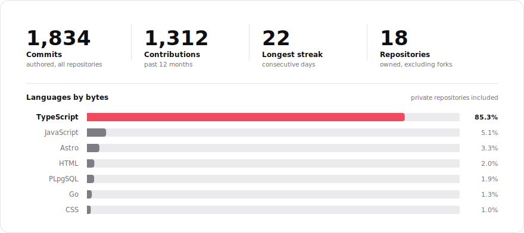
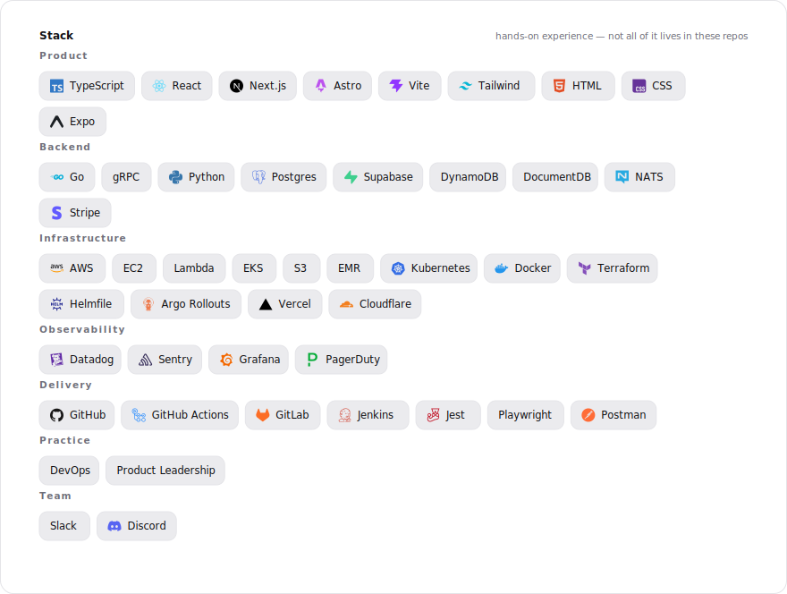
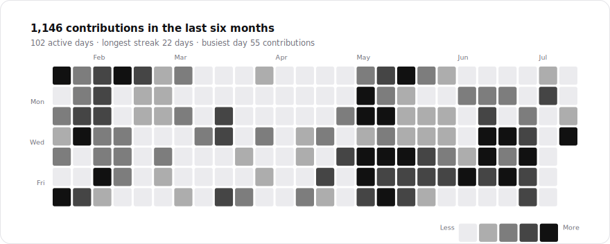
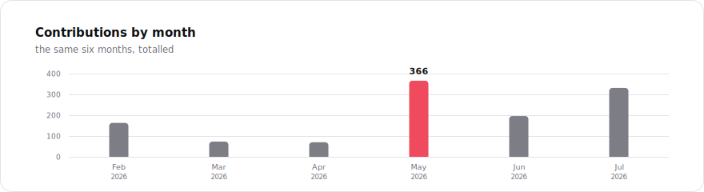

<picture>
  <source media="(prefers-color-scheme: dark)" srcset="./generated/header-dark.svg">
  <source media="(prefers-color-scheme: light)" srcset="./generated/header-light.svg">
  
</picture>

Almost everything I work on lives in private repositories, which makes the usual profile
badges read zero. So these are generated from the GitHub API instead — real numbers,
aggregated, naming nothing.

<picture>
  <source media="(prefers-color-scheme: dark)" srcset="./generated/stats-dark.svg">
  <source media="(prefers-color-scheme: light)" srcset="./generated/stats-light.svg">
  
</picture>

<picture>
  <source media="(prefers-color-scheme: dark)" srcset="./generated/stack-dark.svg">
  <source media="(prefers-color-scheme: light)" srcset="./generated/stack-light.svg">
  
</picture>

<picture>
  <source media="(prefers-color-scheme: dark)" srcset="./generated/heatmap-dark.svg">
  <source media="(prefers-color-scheme: light)" srcset="./generated/heatmap-light.svg">
  
</picture>

<picture>
  <source media="(prefers-color-scheme: dark)" srcset="./generated/months-dark.svg">
  <source media="(prefers-color-scheme: light)" srcset="./generated/months-light.svg">
  
</picture>

<picture>
  <source media="(prefers-color-scheme: dark)" srcset="./generated/snake-dark.svg">
  <source media="(prefers-color-scheme: light)" srcset="./generated/snake-light.svg">
  
</picture>
